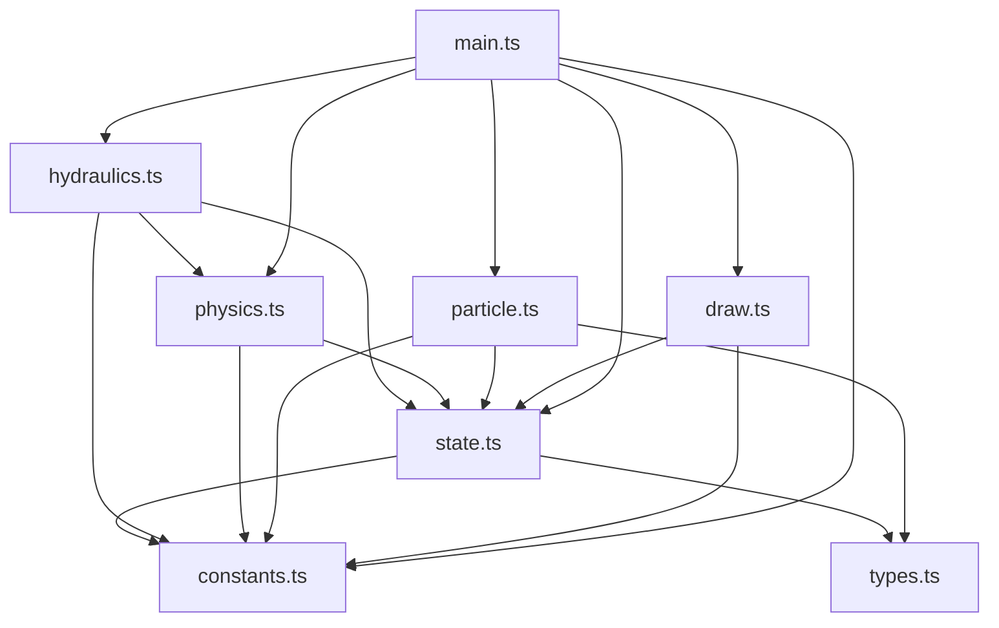

# Анализ структуры кода проекта

## Текущая разбивка (без HTML)

| Файл | Назначение |
|------|------------|
| [main.ts](main.ts) | Точка входа, gameLoop, init, обработчики кнопок/слайдеров, save/load, переключение меню |
| [draw.ts](draw.ts) | Отрисовка: трубы, краны, радиатор, коллекторы, частицы, фон |
| [particle.ts](particle.ts) | Класс Particle — логика и анимация потока частиц |
| [physics.ts](physics.ts) | Тепловая модель: ε-NTU, Kroom, равновесная T_room (Ньютон-Рафсон) |
| [hydraulics.ts](hydraulics.ts) | Гидравлика: сопротивление, потоки, расчёт стояка |
| [constants.ts](constants.ts) | Константы, геометрия (L), PIPE_DATA, VALVE_DATA, tempToColor |
| [state.ts](state.ts) | Мутабельное состояние: mode, canvas, флаги видимости, сеттеры |
| [types.ts](types.ts) | Интерфейсы и типы TypeScript |

## Схема зависимостей

## Плюсы такой структуры

1. **Разделение ответственности (SRP)** — каждый модуль решает одну задачу: физика в physics, гидравлика в hydraulics, отрисовка в draw.
2. **Удобная поддержка** — изменения в тепловой модели не затрагивают draw; правки визуала не трогают physics.
3. **Тестируемость** — physics и hydraulics можно тестировать отдельно, без DOM и canvas.
4. **Переиспользование** — constants, types, physics можно использовать в других проектах (например, CLI-расчёт).
5. **Читаемость** — по имени файла понятно, где искать логику (тепло — physics, потоки — hydraulics).
6. **Меньше конфликтов при совместной работе** — разные люди могут править разные модули.
7. **Типизация** — types.ts даёт единые интерфейсы для всего проекта.

## Что можно улучшить (по желанию)

- **physics.ts** и **hydraulics.ts** зависят от DOM через `gv()` — лучше передавать параметры явно.
- **draw.ts** (~700 строк) — при росте можно разбить на drawPipes, drawRadiator, drawCollectors.
- **main.ts** (~980 строк) — часть логики (save/load, toggles) можно вынести в отдельные модули.

## Вывод

Разбиение сделано логично: физика, гидравлика, визуал и состояние разделены, зависимости идут через constants и state. Структура соответствует обычной практике для такого проекта.
